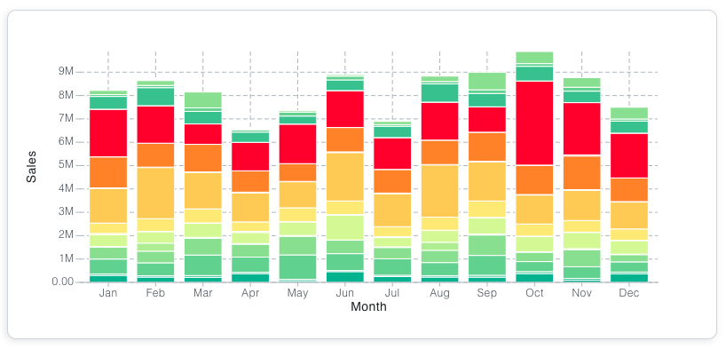
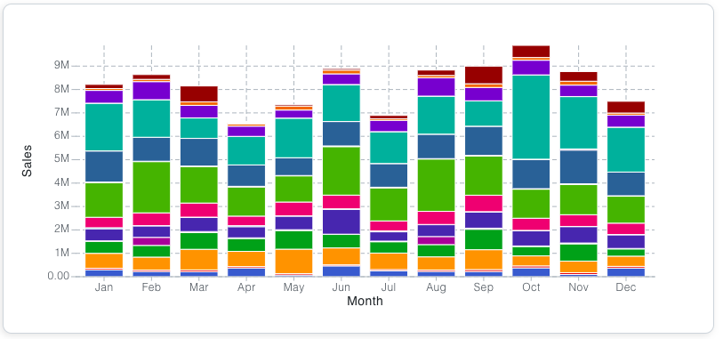
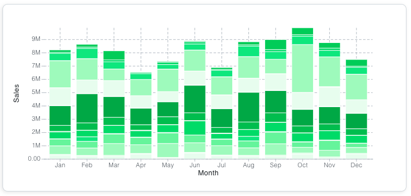
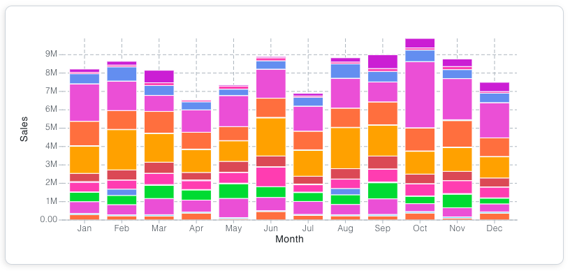

## Overview

The Motor JS provides a base color system which can be edited to match your brand colors and style. 
All of the colors used in the framework are defined in our theme object, within <b>global.color</b>.

:::info
The global.color object is documented on the API section of the Theming page
:::

Al of these colors can be referenced from our components or edited via our theme object. 
You can find an example of this below.


### Referencing & Editing the base colors

In the below example, the Box is referencing the brand color via the backgroundColor prop. 
This brand entry has also been edited in the Motor Component and changed to green.

You can try editing the live code below to change the brand color, or even, reference a different color.
Try changing the backgroundColor prop to equal 'accent1', you'll see this reference the accent1 entry in the global.color object.


```jsx
function BoxDemo() {

  return (
    <Motor theme={{
      global: {
        color: {
          brand: 'green'
        }
      }
    }}>
    <Box
      height="100px"
      width="300px"
      backgroundColor='brand'
    />
    </Motor>
  );
}
```


## Open Color

Motor JS come bundled with Open Color (https://yeun.github.io/open-color/) an open source color scheme.

These are all stored in variables which can be accessed throughout the framework. See below for an example of how to reference
the range of blues from open color.

<div style={{ display: 'flex', flexWrap: 'wrap' }}>
<div style={{ padding: '20px', margin: '5px', backgroundColor: 'var(--oc-blue-0)' }}>
  <h3>var(--oc-blue-0)</h3>
</div>
<div style={{ padding: '20px', margin: '5px', backgroundColor: 'var(--oc-blue-1)' }}>
  <h3>var(--oc-blue-1)</h3>
</div>
<div style={{ padding: '20px', margin: '5px', backgroundColor: 'var(--oc-blue-2)' }}>
  <h3>var(--oc-blue-2)</h3>
</div>
<div style={{ padding: '20px', margin: '5px', backgroundColor: 'var(--oc-blue-3)' }}>
  <h3>var(--oc-blue-3)</h3>
</div>
<div style={{ padding: '20px', margin: '5px', backgroundColor: 'var(--oc-blue-4)' }}>
  <h3>var(--oc-blue-4)</h3>
</div>
<div style={{ padding: '20px', margin: '5px', backgroundColor: 'var(--oc-blue-5)' }}>
  <h3>var(--oc-blue-5)</h3>
</div>
<div style={{ padding: '20px', margin: '5px', backgroundColor: 'var(--oc-blue-6)' }}>
  <h3>var(--oc-blue-6)</h3>
</div>
<div style={{ padding: '20px', margin: '5px', backgroundColor: 'var(--oc-blue-7)' }}>
  <h3>var(--oc-blue-7)</h3>
</div>
<div style={{ padding: '20px', margin: '5px', backgroundColor: 'var(--oc-blue-8)' }}>
  <h3>var(--oc-blue-8)</h3>
</div>
<div style={{ padding: '20px', margin: '5px', backgroundColor: 'var(--oc-blue-9)' }}>
  <h3>var(--oc-blue-9)</h3>
</div>
</div>

<br />

### KPI using a color variable from Open Color

```jsx
function ColumnDemo() {
  return (
    <Motor config={config}>
      <KPI
        color='var(--oc-blue-5)'
        label="My Blue KPI"
        cols={["=100"]}
      />
    </Motor>
  );
}
```

## Using Colors in Charts

All of our charts come with a <b>colorTheme</b> prop which enables you to customise their colors. This section will cover some examples.

### Using the default color palettes

Our base themes contain a number of default color palettes which are found in the base theme object, in global.colors. See below for some examples 

#### Example using the <b>divergent13</b> palette



```javascript
  <Bar 
    width={800}
    height={350}
    colorTheme="divergent13"
    showLegend={false}
    showLabels={false}
    stacked
    cols={[
      { qField: '[Month]', qLabel: 'Month' },
      { qField: '[Product Group Desc]', qLabel: 'Product Group' },
      { qField: '=sum([Sales Amount])', qLabel: 'Sales'},
    ]}
  />

```

#### Example using the <b>eco</b> palette



```javascript
  <Bar 
    width={800}
    height={350}
    colorTheme="eco"
    showLegend={false}
    showLabels={false}
    stacked
    cols={[
      { qField: '[Month]', qLabel: 'Month' },
      { qField: '[Product Group Desc]', qLabel: 'Product Group' },
      { qField: '=sum([Sales Amount])', qLabel: 'Sales'},
    ]}
  />

```

### Using a color string

You can pass a single color as a string, which will create an array of colors from Open Color. If there is no match with Open Color, the colors of the bar chart will default to black. 
If you want the chart to have a single color, pass an array of one color instead.



```javascript
  <Bar 
    width={800}
    height={350}
    colorTheme="green"
    showLegend={false}
    showLabels={false}
    stacked
    cols={[
      { qField: '[Month]', qLabel: 'Month' },
      { qField: '[Product Group Desc]', qLabel: 'Product Group' },
      { qField: '=sum([Sales Amount])', qLabel: 'Sales'},
    ]}
  />

```

### Using an array of colors

You can pass an array of colors, to build your own color palette



```javascript
  <Bar 
    width={800}
    height={350}
    colorTheme={
      ['#ff7f50','#87cefa','#da70d6','#32cd32','#6495ed',
      '#ff69b4','#ba55d3','#cd5c5c','#ffa500','#40e0d0']
    }
    showLegend={false}
    showLabels={false}
    stacked
    cols={[
      { qField: '[Month]', qLabel: 'Month' },
      { qField: '[Product Group Desc]', qLabel: 'Product Group' },
      { qField: '=sum([Sales Amount])', qLabel: 'Sales'},
    ]}
  />

```
