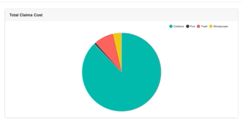
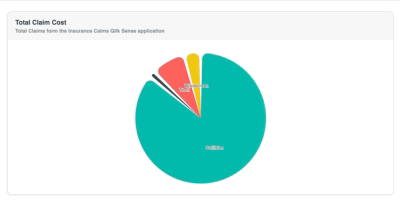

#### Pie chart. A chart displaying a pie chart.

<!--  -->



## Usage

```javascript

import { Pie } from @motor-js/core
//...
  <Pie
    width={900}
    height={450}
    title="Claims by Claim type"
    size='medium'
    colorTheme="bio"
    selectionMethod="click"
    showLabels={false}
    legendShape="circle"
    cols={[
      { qField: 'Claim Type', qLabel: 'Claim Type' },
      { qField: '=Sum([Total Claim Cost])', qLabel: 'Total Claims Cost' },
    ]}
  />

```

This is a simple example, which can get more complex by setting various other propertes.
More advanced versions demonstrating various functioanlities can be found in the examples section

## Props

<table>
  <tr>
    <th>Prop</th>
    <th>Description</th>
    <th>Options / Example</th>
  </tr>
  <tr>
    <td>
      <code>cols</code>
    </td>
    <td>Columns from Qlik Data Model to render in the chart. </td>
    <td>
      <code>array</code>
      <br />
      &#123;[
      <br />
      "Claim Type",
      <br />
      "=Sum([Total Claim Cost])"
      <br />
      ]&#125;
    </td>
  </tr>
  <tr>
    <td>
      <code>calcCondition</code>
    </td>
    <td>Calculated condition to be met before chart can be displayed.</td>
    <td>
      <code>shape</code>
      <br />
      &#123;
      <br />
      qCond: "=Avg([Case Duration Time])> 5",
      <br />
      qMsg: "Calculation condition has not been met",
      <br />
      &#125;
    </td>
  </tr>
  <tr>
    <td>
      <code>suppressZero</code>
    </td>
    <td>Suppress items whith zero values from being displayed in the chart</td>
    <td>
      <code>boolean</code>
      <br />
      <b>* default obtained from theme.</b>
    </td>
  </tr>
  <tr>
    <td>
      <code>suppressMissing</code>
    </td>
    <td>
      Suppress items whith missing values from being displayed in the chart
    </td>
    <td>
      <code>boolean</code>
      <br />
      <b>* default obtained from theme.</b>
    </td>
  </tr>
  <tr>
    <td>
      <code>sortOrder</code>
    </td>
    <td>Order of the pies on which the returned data shoud be sorted</td>
    <td>
      <code>array</code>
      <br />
      [1,0]
    </td>
  </tr>
  <tr>
    <td>
      <code>sortDirection</code>
    </td>
    <td>
      Direction by which the chart should be sorted. Can either be ascending or
      descending.
    </td>
    <td>
      <code>string</code>
      <br />
      <b>'ASCENDING'</b>
      <br />
      'ASC'
      <br />
      'DESCENDING'
      <br />
      'DESC'
      <br />
    </td>
  </tr>
  <tr>
    <td>
      <code>width</code>
    </td>
    <td>
      Chart width as a number which will be converted to pixels. If not set, the
      parent container width will be used
    </td>
    <td>
      <code>number</code>
    </td>
  </tr>
  <tr>
    <td>
      <code>height</code>
    </td>
    <td>
      Chart width as a number which will be converted to pixels. If not set, the
      parent container width will be used{" "}
    </td>
    <td>
      <code>number</code>
    </td>
  </tr>
  <tr>
    <td>
      <code>margin</code>
    </td>
    <td>The margin size around the component</td>
    <td>
      <code>string</code>
      <br />
      <b>'5px'</b>
    </td>
  </tr>
  <tr>
    <td>
      <code>size</code>
    </td>
    <td>Size of the text used in the chart</td>
    <td>
      <code>oneOf</code>
      <br />
      'tiny'
      <br />
      'small'
      <br />
      <b>'medium'</b>
      <br />
      'large'
      <br />
      'xlarge'
    </td>
  </tr>
  <tr>
    <td>
      <code>showLabels</code>
    </td>
    <td>Label position of values for the chart</td>
    <td>
      <code>oneOf</code>
      <br />
      'top'
      <br />
      <b>"none"</b>
      <br />
      'inside'
      <br />
      <b>* default obtained from theme.</b>
      <br />
    </td>
  </tr>
  <tr>
    <td>
      <code>showBoxShadow</code>
    </td>
    <td>Show a shadow around the main chart container</td>
    <td>
      <code>boolean</code>
      <br />
      <b>* default obtained from theme.</b>
    </td>
  </tr>
  <tr>
    <td>
      <code>border</code>
    </td>
    <td>Border to be dispalyed around the chart</td>
    <td>
      <code>boolean</code>
      <br />
      <code>oneOf</code>
      <br />
      "top"
      <br />
      "left"
      <br />
      "bottom"
      <br />
      "right"
      <br />
      "start"
      <br />
      "end"
      <br />
      "horizontal"
      <br />
      "vertical"
      <br />
      "all"
      <br />
      "between"
      <br />
      "none"
      <br />
      <b>* default obtained from theme.</b>
    </td>
  </tr>
  <tr>
    <td>
      <code>backgroundColor</code>
    </td>
    <td>Background color the chart</td>
    <td>
      <code>string</code>
      <br />
      <b>* default obtained from theme.</b>
    </td>
  </tr>
  <tr>
    <td>
      <code>backgroundStyle</code>
    </td>
    <td>
      Colour gradinet of chart background. Pass style of one of below or pass
      styleFrom and styleTo
    </td>
    <td>
      <code>oneOf</code>
      <br />
      'Linear (to be used for custom gradient)'
      <br />
      'Radial (to be used for custom gradient)'
      <br />
      'DarkGreen'
      <br />
      'LightGreen'
      <br />
      'OrangeRed'
      <br />
      'PinkBlue'
      <br />
      'PinkRed'
      <br />
      'PurpleOrange'
      <br />
      'PurpleRed'
      <br />
      'PurpleTeal'
      <br />
      'SteelPurple'
      <br />
      'TealBlue'
      <br />
      'e.g'
      <br />
      '&#123; style: "PinkBlue" &#125;'
      <br />
      '&#123; style: "Linear", styleFrom: "#fadadd", styleTo: "#89cff0" &#125;'
    </td>
  </tr>
  <tr>
    <td>
      <code>borderRadius</code>
    </td>
    <td>Border radius of the border around the chart</td>
    <td>
      <code>string</code>
      <br />
      <b>* default obtained from theme.</b>
    </td>
  </tr>
  <tr>
    <td>
      <code>colorTheme</code>
    </td>
    <td>Color scheme to be used for the chart</td>
    <td>
      <code>array</code>
      <br />
      <code>oneOf</code>
      <br />
      "motor"
      <br />
      "divergent13"
      <br />
      "divergent9"
      <br />
      "eco"
      <br />
      "bio"
      <br />
      "red"
      <br />
      "blue"
      <br />
      "gray"
      <br />
      "pink"
      <br />
      "grape"
      <br />
      "violet"
      <br />
      "indigo"
      <br />
      "blue"
      <br />
      "cyan"
      <br />
      "teal"
      <br />
      "green"
      <br />
      "lime"
      <br />
      "yellow"
      <br />
      "orange"
      <br />
      <b>* default obtained from theme.</b>
    </td>
  </tr> <tr>
    <td>
      <code>roundNum</code>
    </td>
    <td>Use round numbering to dispaly labels on charts</td>
    <td>
      <code>bool</code>
      <br />
      <b>* default obtained from theme.</b>
    </td>
  </tr>
  <tr>
    <td>
      <code>precision</code>
    </td>
    <td>Number of decimal precsion when displaying pie labels</td>
    <td>
      <code>number</code>
    </td>
  </tr>
  <tr>
    <td>
      <code>title</code>
    </td>
    <td>Title to be dispalyed on top of chart</td>
    <td>
      <code>string</code>
      <br />
      <b>* default obtained from theme.</b>
    </td>
  </tr>
  <tr>
    <td>
      <code>subTitle</code>
    </td>
    <td>Sub title to be dispalyed on top of chart</td>
    <td>
      <code>string</code>
      <br />
      <b>* default obtained from theme.</b>
    </td>
  </tr>
  <tr>
    <td>
      <code>showLegend</code>
    </td>
    <td>Display chart legend.</td>
    <td>
      <code>bool</code>
      <br />
      <code>oneOf</code>
      <br />
      "right"
      <br /> "bottom"
      <br />
    </td>
  </tr>
  <tr>
    <td>
      <code>otherTotalSpec</code>
    </td>
    <td>
      Message to be displayed if an invalid measure is used in the cols property
    </td>
    <td>
      <code>bool</code>
      <br />
      <code>shape</code>
      <br />
      &#123;
      <br />
      qOtherLabel: "Other",
      <br />
      qOtherCount: "5",
      <br />
      &#125;
      <br />
      <b>* default obtained from theme.</b>
    </td>
  </tr>
  <tr>
    <td>
      <code>gridArea</code>
    </td>
    <td>Name of the parent grid to place the Pie chart</td>
    <td>
      <code>string</code>
    </td>
  </tr>
  <tr>
    <td>
      <code>showBoxShadoow</code>
    </td>
    <td>Show or hide box shadow</td>
    <td>
      <code>boolean</code>
    </td>
  </tr>
  <tr>
    <td>
      <code>selectionMethod</code>
    </td>
    <td>Change the selection method, either click or brush</td>
    <td>
      <code>oneOf</code>
      <br />
      'none'
      <br />
      'click'
    </td>
  </tr>
  <tr>
    <td>
      <code>legendTopBottom</code>
    </td>
    <td>Render the legend on the top or bottom of the chart</td>
    <td>
      <code>string</code>
      <br />
      'top'
      <br />
      'bottom'
    </td>
  </tr>
  <tr>
    <td>
      <code>legendLeftRight</code>
    </td>
    <td>Render the legend on the left or right of the chart</td>
    <td>
      <code>string</code>
      <br />
      'left'
      <br />
      'right'
    </td>
  </tr>
  <tr>
    <td>
      <code>legendDirection</code>
    </td>
    <td>Direction of the legend values</td>
    <td>
      <code>string</code>
      <br />
      'row'
      <br />
      'column'
    </td>
  </tr>
  <tr>
    <td>
      <code>legendShape</code>
    </td>
    <td>shape of the indicator for the legend</td>
    <td>
      <code>string</code>
      <br />
      'cirlce'
      <br />
      'line'
      <br />
      'dashed-line'
      <br />
      'rect'
      <br />
      <b>'auto (rect)'</b>
    </td>
  </tr>
  <tr>
    <td>
      <code>showTooltip</code>
    </td>
    <td>Turns the tooltip on or off</td>
    <td>
      <code>boolean</code>
    </td>
  </tr>
  <tr>
    <td>
      <code>strokeWidth</code>
    </td>
    <td>Width of the stroke around each pie</td>
    <td>
      <code>number</code>
    </td>
  </tr>
  <tr>
    <td>
      <code>stroke</code>
    </td>
    <td>Color of the stroke around each pie</td>
    <td>
      <code>string</code>
    </td>
  </tr>
  <tr>
    <td>
      <code>legendLabelStyle</code>
    </td>
    <td>Object to be used for the styling of the legend labels</td>
    <td>
      <code>object</code>
      <br />
      'e.g.'
      <br />' &#123; fill: "darkblue", fontWeight: 800, &#125; '
    </td>
  </tr>
  <tr>
    <td>
      <code>valueLabelStyle</code>
    </td>
    <td>Object to be used for the styling of the value labels</td>
    <td>
      <code>object</code>
      <br />
      'e.g.'
      <br />' &#123; fill: "white", stroke: "red"", &#125; '
    </td>
  </tr>
  <tr>
    <td>
      <code>cornerRadius</code>
    </td>
    <td>Value to round corners on pie.</td>
    <td>
      <code>number</code>
    </td>
  </tr>
  <tr>
    <td>
      <code>padAngle</code>
    </td>
    <td>Padding angle on pie.</td>
    <td>
      <code>number</code>
    </td>
  </tr>
  <tr>
    <td>
      <code>isDonut</code>
    </td>
    <td>Render chart as a donut.</td>
    <td>
      <code>boolean</code>
    </td>
  </tr>
  <tr>
    <td>
      <code>donutThickness</code>
    </td>
    <td>Width of the donut.</td>
    <td>
      <code>number</code>
    </td>
  </tr>
  <tr>
    <td>
      <code>pieSort</code>
    </td>
    <td>Sort each pie segment by lables.</td>
    <td>
      <code>oneOf</code>
      <br />
      'asc'
      <br />
      'desc'
      <br />
      <b>'ASC'</b>
      <br />
      'DESC'
      <br />
      'Ascending'
      <br />
      'ASCENDING'
      <br />
      'Descending'
      <br />
      'DESCENDING'
    </td>
  </tr>
  <tr>
    <td>
      <code>pieSortValues</code>
    </td>
    <td>Sort each pie segment by value.</td>
    <td>
      <code>oneOf</code>
      <br />
      'asc'
      <br />
      'desc'
      <br />
      <b>'ASC'</b>
      <br />
      'DESC'
      <br />
      'Ascending'
      <br />
      'ASCENDING'
      <br />
      'Descending'
      <br />
      'DESCENDING'
    </td>
  </tr>
</table>

## Sample Syntax

### cols settings

<h4>Overview</h4>
There are three different ways of specifying the columns:

- As a string.
- As an Object
- As a reference to a predefined dimension or measure, a Master Item.

<b>String syntax</b>
<br />

If a string starts with =, it will be treated as a measure, otherwise it is
treated as a dimension.

```jsx {4-7}
import { Pie } from "@motor-js/core";

<Pie
  cols={[
  "Claim Type,
  "=Sum([Total Claim Cost])"
]}
  ....
/>
```

<b>Object syntax</b>
<br />

Use the object syntax if you want to set more options for your columns. If you. for example, create a pivot table with labels, you should use qFieldLabels for dimensions and qLabel for measures.

```jsx {4-28}
import { Pie } from "@motor-js/core";

<Pie
  cols={[
  /*dimension with label*/
   { qField: 'Claim Type', qLabel: 'Claim Type' },
  /*measure with label*/
  { qField: '=Sum([Total Claim Cost])', qLabel: 'Total Claims Cost' },
]}
  ....
/>
```

<b>Predefined dimensions and measures syntax</b>
<br />

You can use dimensions and measures that are predefined in the app. This is mostly relevant if the user should be able to select dimensions and measures from lists. You must know the Dimension ID or the Measure ID, which is defined in the qLibraryID property. You must also state if it is a measure or a dimension in the qType property.

```jsx {4-8}
import { Pie } from "@motor-js/core";

<Pie
  cols={[
  {
    "qLibraryId":"eqZjE",
    "qType":"measure"
  }
]}
  ....
/>
```

### calcCondition settings

```jsx {5-8}
import { Pie } from "@motor-js/core";

  <Pie
    ....
    calcCondition={{
      qCond: '1+1=2',
      qMsg: 'Calculation condition has not been met',
    }}
  />
```

### otherTotalSpec settings

```jsx {5-8}
import { Pie } from "@motor-js/core";

  <Pie
   ....
          otherTotalSpec={{
             qOtherLabel: 'Other',
             qOtherCount: '5'
           }}
     />
```

## Examples

These examples are based off the Consumer Sales Qlik Sense application.

### Donut Chart

The first example is a donut chart.


```jsx
function DonutDemo() {
  return (
    <Motor config={config}>
      <Pie
        title="Total Claim Cost"
        subTitle="Total Claims form the Insurance Caims Qlik Sense application"
        isDonut
        showLegend
        legendShape="circle"
        colorTheme="bio"
        selectionMethod="click"
        showTooltip={true}
        showLabels={true}
        cols={[
          { qField: "Claim Type", qLabel: "Claim Type" },
          { qField: "=Sum([Total Claim Cost])", qLabel: "Total Claims Cost" },
        ]}
      />
    </Motor>
  );
}
```

### Pie chart with corner Radius and Padding Angle set



```jsx
function ColumnDemo() {
  return (
    <Motor config={config}>
      <Pie
        title="Total Claim Cost"
        subTitle="Total Claims form the Insurance Caims Qlik Sense application"
        showLegend
        legendShape="circle"
        colorTheme="bio"
        selectionMethod="click"
        padAngle={0.05}
        cornerRadius={15}
        showTooltip={true}
        showLabels={true}
        cols={[
          { qField: "Claim Type", qLabel: "Claim Type" },
          { qField: "=Sum([Total Claim Cost])", qLabel: "Total Claims Cost" },
        ]}
      />
    </Motor>
  );
}
```

## Theme API

All components are styled from the main theme. Each theme can be overwtitten which will allow for all charts to share common functionality without having to set the props at an individual level.

Most of the chart settings are in global.chart. Changing any setting in the above will apply to all charts within the application. Specific pie chart related theme items are stored in pie. Changing these settings will apply to all pie charts within the application.

Theme settings can be overwritten at a global level, see below for an example.

```javascript

import { Motor, ... } from @motor-js/core
//...

  const myTheme = {
    global: {
      colorTheme: "divergent9",
    },
  };

  <Motor config={config} theme={myTheme}>
    ...
  </Motor>

```

### global.chart

The global.chart object is documented below.

```javascript

    chart: {
      border: {
        color: "var(--oc-gray-4)",
        size: "1px",
        style: "solid",
      },
      wrapper: {
        borderRadius: "10px",
        backgroundColor: "white",
        userSelect: "none", // add to props
        display: "flex", // add to props
        boxSizing: "border-box",
        position: "relative",
        padding: "16px 16px 0px",
        fontWeight: "normal",
        minHeight: "200px",
        textDecoration: "none",
        showBoxShadow: true,
        boxShadow: "rgba(0, 0, 0, 0.1) -2px 2px 8px 0px",
        flexDirection: "column",
      },
      error: {
        // dataErrorMsg: 'Invalid Dimension or Measure.',
        dimensionErrMsg: "Invalid Dimension.",
        measureErrMsg: "Invalid Measure. No values returned.",
      },
      titles: {
        wrapper: {
          display: "flex",
          flexDirection: "column",
          webkitBoxPack: "justify",
          justifyContent: "space-between",
          maxHeight: "50px",
          backgroundColor: "rgb(247, 247, 247)",
          margin: "-16px -16px 0px",
          padding: "15px 20px",
          marginBottom: "15px",
        },
        title: {
          color: "var(--oc-gray-8)",
          fontSize: {
            tiny: "14px",
            small: "16px",
            medium: "18px",
            large: "20px",
            xlarge: "22px",
          },
        },
        subTitle: {
          color: "var(--oc-gray-6)",
          fontSize: {
            tiny: "10px",
            small: "12px",
            medium: "14px",
            large: "16px",
            xlarge: "18px",
          },
        },
      },
      suppressZero: false,
      suppressMissing: false,
      otherTotalSpec: undefined,
      showLegend: true,
      margin: "10px",
      includeZero: true,
      selectionMethod: "click",
      autoWidth: false,
      color,
      showLabels: true,
      roundNum: true,
      precision: true,
      noData: {
        verticalAlign: "top",
        borderRadius: "10px",
        // backgroundColor: "var(--oc-gray-1)",
        backgroundColor: "white",
        // borderCollapse: "collapse",
      },
      noDataContent: {
        display: "flex",
        alignItems: "center",
        justifyContent: "center",
        margin: "10px",
      },
      baseColor: "#fff",
      colors: [
        "#0b7285",
        "#15aabf",
        "#fcc419",
        "#ff8787",
        "#6741d9",
        "#e599f7",
      ],
      legendStyles: {
        backgroundColor: "#fff",
        // stroke: "white",
        // opacity: 1,
        // borderRadius: "10px",
        // legendGroup: { opacity: "1", userSelect: "none" },
        // legendText: { fill: "var(--oc-gray-7)" },
      },
      legendLabelStyles: {
        fill: "#212529",
        stroke: "none",
        fontFamily,
        fontSize: {
          tiny: "10px",
          small: "12px",
          medium: "14px",
          large: "16px",
          xlarge: "18px",
        },
        letterSpacing: 0.4,
        textAnchor: "middle",
        fontWeight: "normal",
        pointerEvents: "none",
      },
      backgroundStyles: {
        pattern: null,
        stroke: "#adb5bd",
        strokeWidth: 0.5,
        style: undefined,
        styleFrom: undefined,
        styleTo: undefined,
      },
      fillStyles: {
        style: undefined,
        styleFrom: undefined,
        styleTo: undefined,
      },
      selection: {
        opacity: 1,
        // stroke: "black",
        // strokeWidth: "1px",
      },
      nonSelection: {
        opacity: 0.5,
        // background: "var(--oc-gray-1)",
      },
      hover: {
        opacity: 0.5,
        // background: "var(--oc-gray-1)",
      },
      tooltip: {
        // snapToDataX: false,
        // snapToDataX: false,
        valueOnly: false,
        valueWithText: false,
        showClosestItem: true, // Used for tooltip
        useSingleColor: false, // Used for tooltip. True uses colors as per headingColor
        headingColor: "altDark",
        tooltipStyles: {
          borderRadius: "3px",
          boxShadow: "0 1px 2px rgba(33,33,33,0.2)",
          fontSize: {
            tiny: "10px",
            small: "12px",
            medium: "14px",
            large: "16px",
            xlarge: "18px",
          },
          lineHeight: "1em",
          padding: ".3rem .5rem",
          pointerEvents: "none",
          position: "absolute",
          backgroundColor: "#fff",
          color: "altDark",
          textAlign: null,
        },
      },
      valueLabelStyles: {
        fill: "#495057",
        stroke: "#fff",
        fontFamily,
        fontSize: {
          tiny: "8px",
          small: "10px",
          medium: "12px",
          large: "14px",
          xlarge: "16px",
        },
        letterSpacing: 0.4,
        strokeWidth: 2,
        fontWeight: "normal",
        textAnchor: "middle",
        pointerEvents: "none",
        paintOrder: "stroke",
      },
    },

```

### global.pie

```javascript

 pie: {
    margin: { top: 20, right: 20, bottom: 20, left: 20 },
    stroke: "#adb5bd",
    strokeWidth: 0.5,
    cornerRadius: 3,
    padAngle: 0.005,
    isDonut: false,
    donutThickness: 50,
  }

```
